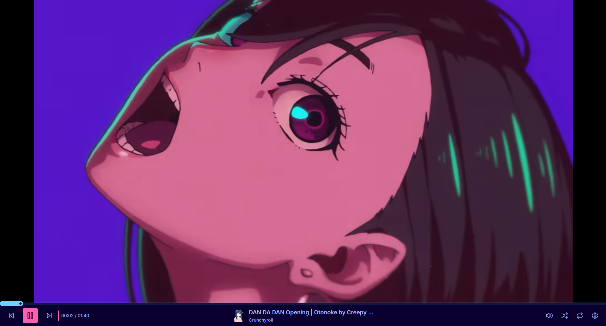
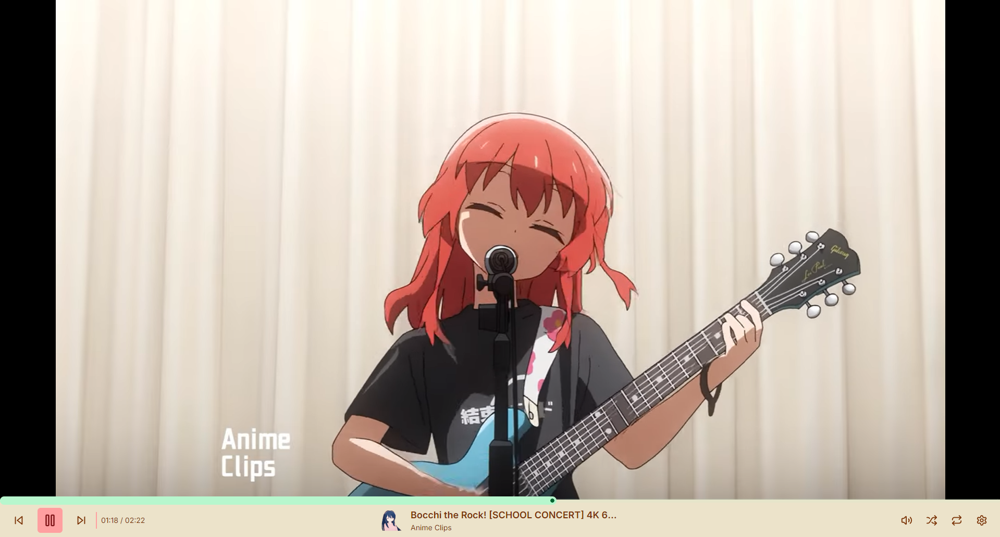
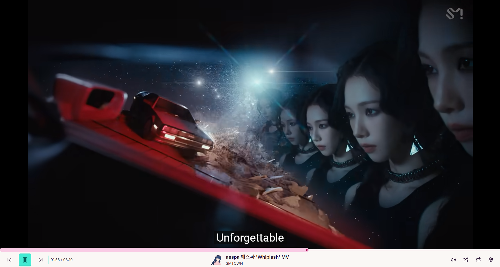

# 🎥 YouTube Wallpaper - Bring Your Screen to Life!

**Transform any YouTube video into your dynamic desktop wallpaper!** 🌟

This isn't just a wallpaper—it's an **interactive experience** powered by the [YouTube IFrame API](https://developers.google.com/youtube/iframe_api_reference). Change videos on the fly, customize playback, and make your desktop uniquely yours!

---

## 🖼️ Preview Gallery

### Default Thumbnail



### More Stunning Examples





_(Want to see it in action? Try it out below!)_

---

## 🚀 Features

✔ **Seamless YouTube Integration** – Play any video as your wallpaper  
✔ **Real-Time Customization** – Swap videos anytime, no restart needed  
✔ **Sleek & Modern UI** – Easy controls with a beautiful design  
✔ **Persistent Settings** – Saves preferences with `LocalStorage`  
✔ **Lightweight & Fast** – Optimized for smooth performance

---

## 🔧 Tech Stack

⚡ **React JS** – Smooth, reactive frontend  
🎨 **Tailwind CSS + Daisy UI** – Clean, customizable styling  
💾 **Zustand + LocalStorage** – Effortless state & storage management

---

## � Get It Now on Steam!

[](https://steamcommunity.com/sharedfiles/filedetails/?id=3463140490)

👉 [Download on Steam Workshop](https://steamcommunity.com/sharedfiles/filedetails/?id=3463140490)

---

## 🛠️ Installation & Usage

```bash
# Clone the repository
git clone https://github.com/OriginalCube/Youtube-Wallpaper.git

# Install dependencies
pnpm install

# Run the development server
pnpm run dev
```
